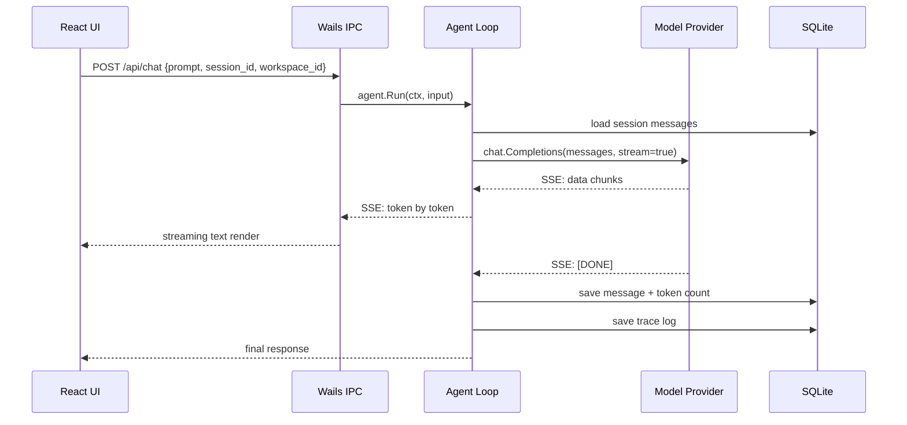
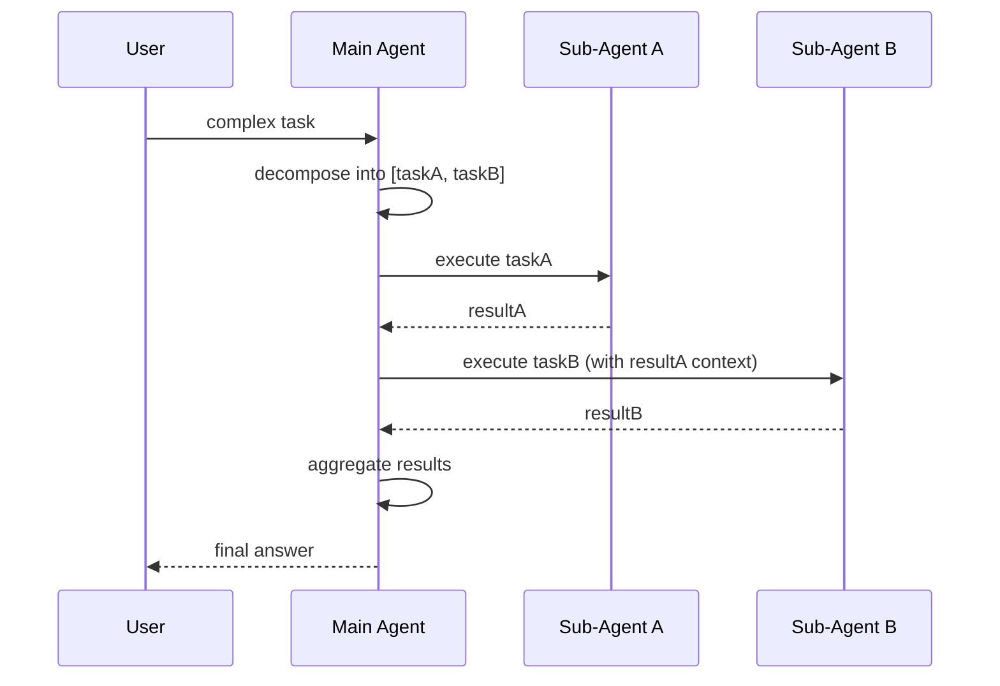
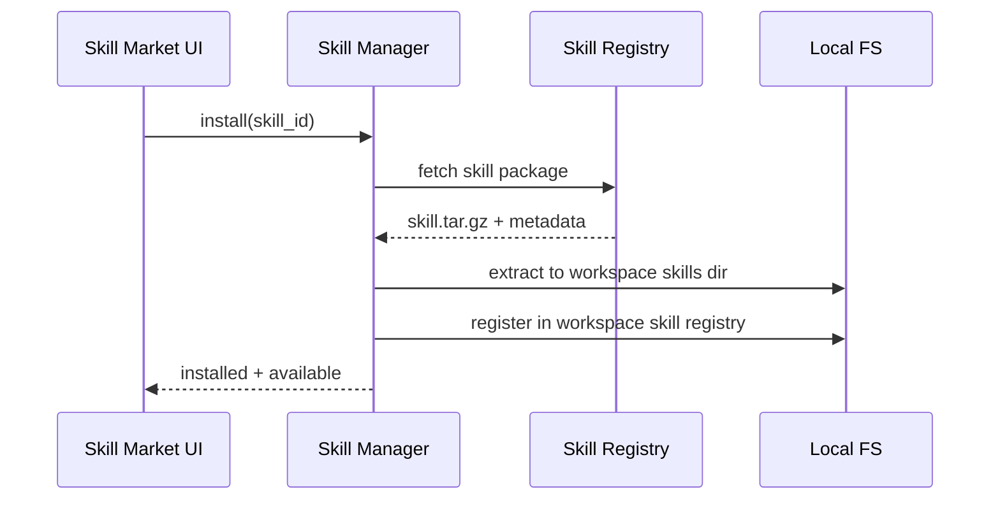

# Arch Design: 智能助手客户端套件（Smart Assistant Client）

> **Slug**: `smart-assistant-client`
> **版本**: v0.1
> **状态**: Draft → Plan
> **主责角色**: `architect`
> **创建日期**: 2026-09-10

---

## 1. 系统边界

```
┌─────────────────────────────────────────────────────────┐
│                     Desktop App (Wails)                  │
│  ┌──────────────────────┐  ┌──────────────────────────┐ │
│  │   React Frontend     │  │     Go Backend (engine)   │ │
│  │  (TypeScript+Tailwind)│  │  HTTP/SSE API + Wails IPC │ │
│  └──────────┬───────────┘  └────────────┬─────────────┘ │
│             │          IPC/Wails          │               │
│             └────────────────────────────┘               │
│                        │ SQLite                          │
└────────────────────────┼────────────────────────────────┘
                         │
          ┌──────────────┴──────────────┐
          │      Model API Gateway      │
          │  (OpenAI / Anthropic / ...) │
          └─────────────────────────────┘
```

**边界内外划分：**

| 边界内 | 边界外 |
|--------|--------|
| Go Agent Engine（核心循环、编排、记忆、Trace） | 第三方 LLM API（OpenAI、Anthropic 等） |
| React 桌面 UI（Wails 内嵌 WebView） | v2：移动端（Android/iOS） |
| SQLite 本地存储（对话、配置、Token、Trace） | v2：A2A/ACP 协议栈 |
| 模型适配层（统一多厂商 API） | v2：专家团投票评审 |
| Skill 管理器（安装/卸载/启用/禁用） | v2：Trace DAG 可视化 |

---

## 2. 组件拆分

### 2.1 Go Engine 模块

```
engine/
├── cmd/
│   └── server/main.go          # HTTP/SSE 服务入口
├── internal/
│   ├── agent/                   # Agent 核心循环
│   │   ├── loop.go              # prompt→model→tools→response 主循环
│   │   ├── dispatch.go          # 多 Agent 任务拆分与调度（v1: 串行）
│   │   └── cancel.go            # 取消执行（HITL 基础版）
│   ├── model/                   # 多模型适配
│   │   ├── provider.go          # Provider 接口抽象
│   │   ├── openai.go            # OpenAI-compatible provider
│   │   └── registry.go          # 模型注册与路由
│   ├── session/                 # 会话管理
│   │   ├── session.go           # 会话 CRUD
│   │   └── message.go           # 消息存取
│   ├── workspace/               # 工作空间隔离
│   │   └── workspace.go         # 空间 CRUD + 上下文隔离
│   ├── memory/                  # 长期记忆
│   │   ├── extract.go           # 摘要提取
│   │   └── inject.go            # 选择性注入上下文
│   ├── skill/                   # Skill 市场
│   │   ├── registry.go          # Skill 注册表
│   │   ├── install.go           # 安装/卸载
│   │   └── market.go            # 市场仓库拉取
│   ├── trace/                   # 执行追踪
│   │   └── trace.go             # JSON 日志记录
│   └── auth/                    # 认证
│       └── auth.go              # 本地账号 + JWT
├── pkg/
│   └── store/                   # 数据持久层
│       ├── sqlite.go            # SQLite 连接管理
│       ├── migrate.go           # Schema 迁移
│       └── models/              # 数据模型
│           ├── user.go
│           ├── session.go
│           ├── message.go
│           ├── workspace.go
│           ├── memory.go
│           ├── skill.go
│           └── trace.go
├── api/
│   └── openapi.yaml             # API 契约
├── go.mod
└── go.sum
```

### 2.2 Desktop (Wails) 模块

```
desktop/
├── main.go                      # Wails 入口
├── app.go                       # 后端绑定（Go→JS bridge）
├── wails.json                   # Wails 配置
├── go.mod
├── go.sum
└── frontend/
    ├── package.json
    ├── tsconfig.json
    ├── tailwind.config.js
    ├── index.html
    └── src/
        ├── main.tsx             # React 入口
        ├── App.tsx              # 路由 + 布局
        ├── components/
        │   ├── layout/
        │   │   ├── Sidebar.tsx        # 侧边栏（会话列表/工作空间切换）
        │   │   ├── Header.tsx         # 顶栏（模型切换/设置）
        │   │   └── MainLayout.tsx     # 主布局
        │   ├── chat/
        │   │   ├── ChatView.tsx       # 对话主视图
        │   │   ├── MessageList.tsx    # 消息列表
        │   │   ├── MessageItem.tsx    # 单条消息（Markdown渲染）
        │   │   ├── ChatInput.tsx      # 输入区
        │   │   └── StreamingText.tsx  # 流式打字机效果
        │   ├── workspace/
        │   │   └── WorkspaceSwitcher.tsx
        │   ├── model/
        │   │   └── ModelConfig.tsx    # 模型配置面板
        │   ├── skill/
        │   │   └── SkillMarket.tsx    # Skill 市场
        │   └── settings/
        │       └── Settings.tsx       # 设置页
        ├── hooks/
        │   ├── useChat.ts        # 对话逻辑 hook
        │   ├── useStreaming.ts   # SSE 流式 hook
        │   └── useWorkspace.ts   # 工作空间 hook
        ├── lib/
        │   ├── api.ts            # Go 后端 API 调用
        │   └── store.ts          # 前端状态管理（zustand）
        └── styles/
            └── globals.css       # Tailwind + 设计 token
```

### 2.3 组件职责矩阵

| 模块 | 职责 | 输入 | 输出 |
|------|------|------|------|
| `agent/loop` | 核心对话循环 | prompt + messages + model config | streaming response + tool calls |
| `agent/dispatch` | 多 Agent 任务分发（串行） | task DAG + agent pool | aggregated result |
| `model/provider` | 多模型统一适配 | model config + messages | streaming/non-streaming response |
| `session/` | 会话与消息 CRUD | workspace_id + user_id | session list + messages |
| `workspace/` | 工作空间隔离 | user_id | isolated context per workspace |
| `memory/` | 记忆提取与注入 | session history | memory fragments → context injection |
| `skill/` | Skill 生命周期管理 | skill package | installed skills registry |
| `trace/` | 执行记录 | agent loop events | JSON trace log |
| `auth/` | 认证与授权 | credentials | JWT token |

---

## 3. 关键数据流

### 3.1 对话主流程



### 3.2 多 Agent 编排流程（v1: 串行）



### 3.3 Skill 安装流程



---

## 4. 接口约定

### 4.1 Go Engine HTTP API

| Method | Path | 说明 | Auth |
|--------|------|------|------|
| POST | `/api/auth/register` | 注册 | — |
| POST | `/api/auth/login` | 登录 → JWT | — |
| POST | `/api/chat` | 发送消息 → SSE stream | JWT |
| GET | `/api/sessions` | 会话列表 | JWT |
| GET | `/api/sessions/:id` | 会话消息历史 | JWT |
| DELETE | `/api/sessions/:id` | 删除会话 | JWT |
| POST | `/api/workspaces` | 创建工作空间 | JWT |
| GET | `/api/workspaces` | 工作空间列表 | JWT |
| GET | `/api/models` | 模型配置列表 | JWT |
| PUT | `/api/models/:id` | 更新模型配置 | JWT |
| GET | `/api/stats/tokens` | Token 统计 | JWT |
| GET | `/api/skills` | Skill 列表 | JWT |
| POST | `/api/skills/install` | 安装 Skill | JWT |
| GET | `/api/traces/:session_id` | Trace 日志 | JWT |

### 4.2 数据模型（核心表）

```sql
-- 用户
CREATE TABLE users (
    id TEXT PRIMARY KEY,
    username TEXT UNIQUE NOT NULL,
    password_hash TEXT NOT NULL,
    created_at DATETIME DEFAULT CURRENT_TIMESTAMP
);

-- 工作空间
CREATE TABLE workspaces (
    id TEXT PRIMARY KEY,
    user_id TEXT NOT NULL REFERENCES users(id),
    name TEXT NOT NULL,
    config TEXT,  -- JSON: model prefs, skill list, etc.
    created_at DATETIME DEFAULT CURRENT_TIMESTAMP,
    updated_at DATETIME DEFAULT CURRENT_TIMESTAMP
);

-- 会话
CREATE TABLE sessions (
    id TEXT PRIMARY KEY,
    workspace_id TEXT NOT NULL REFERENCES workspaces(id),
    title TEXT,
    created_at DATETIME DEFAULT CURRENT_TIMESTAMP,
    updated_at DATETIME DEFAULT CURRENT_TIMESTAMP
);

-- 消息
CREATE TABLE messages (
    id TEXT PRIMARY KEY,
    session_id TEXT NOT NULL REFERENCES sessions(id),
    role TEXT NOT NULL,  -- user | assistant | system
    content TEXT NOT NULL,
    token_count INTEGER DEFAULT 0,
    created_at DATETIME DEFAULT CURRENT_TIMESTAMP
);

-- 记忆片段
CREATE TABLE memories (
    id TEXT PRIMARY KEY,
    workspace_id TEXT NOT NULL REFERENCES workspaces(id),
    content TEXT NOT NULL,
    source_session_id TEXT REFERENCES sessions(id),
    enabled INTEGER DEFAULT 1,
    created_at DATETIME DEFAULT CURRENT_TIMESTAMP
);

-- Skill
CREATE TABLE skills (
    id TEXT PRIMARY KEY,
    workspace_id TEXT NOT NULL REFERENCES workspaces(id),
    name TEXT NOT NULL,
    version TEXT NOT NULL,
    enabled INTEGER DEFAULT 1,
    installed_at DATETIME DEFAULT CURRENT_TIMESTAMP
);

-- Trace（执行日志）
CREATE TABLE traces (
    id TEXT PRIMARY KEY,
    session_id TEXT NOT NULL REFERENCES sessions(id),
    agent_id TEXT NOT NULL,
    event_type TEXT NOT NULL,  -- tool_call | thought | response | error
    payload TEXT NOT NULL,     -- JSON
    duration_ms INTEGER,
    created_at DATETIME DEFAULT CURRENT_TIMESTAMP
);

-- Token 统计
CREATE TABLE token_stats (
    id TEXT PRIMARY KEY,
    workspace_id TEXT NOT NULL REFERENCES workspaces(id),
    session_id TEXT REFERENCES sessions(id),
    model_name TEXT NOT NULL,
    input_tokens INTEGER DEFAULT 0,
    output_tokens INTEGER DEFAULT 0,
    created_at DATETIME DEFAULT CURRENT_TIMESTAMP
);
```

---

## 5. 技术选型

| 层级 | 技术 | 版本 | 选型原因 |
|------|------|------|---------|
| 桌面框架 | **Wails v3** | latest | Go 原生后端 + Web 前端，天然满足 Go 引擎要求；比 Electron 轻量 10x |
| 前端框架 | **React 18** + TypeScript | 18.x | 团队熟悉，生态丰富，流式渲染成熟 |
| CSS 框架 | **Tailwind CSS** | 3.x | 快速原型，设计 token 天然映射到 Tailwind config |
| 状态管理 | **Zustand** | 4.x | 轻量，适合中等复杂度桌面应用 |
| 数据库 | **SQLite** (go-sqlite3) | — | 嵌入式，零配置，适合桌面端本地存储 |
| HTTP 路由 | **chi** 或 **gin** | latest | 轻量 Go HTTP router |
| SSE | 标准 `net/http` + `flusher` | — | 无需额外依赖 |
| 模型 API | OpenAI-compatible SDK | — | 兼容 OpenAI/DeepSeek/国内模型 |
| Markdown 渲染 | **react-markdown** + **rehype-highlight** | latest | 消息内容渲染 |
| 打包 | Wails build + NSIS (Win) / DMG (Mac) | — | 内置支持 |

### 5.1 参考 Harness Engineering Code 的设计模式

| Harness 模式 | 本项目应用 |
|-------------|-----------|
| **Rules 系统**（分层规则 + 优先级） | Agent 引擎的 prompt 注入层：系统规则 > 工作空间规则 > 会话规则 |
| **Skills 系统**（可插拔能力包） | Skill 市场：用户按需安装，工作空间隔离 |
| **Agent dispatch**（工具循环） | `agent/loop.go`：prompt→tools→response 主循环，参考 Claude Code tool-use loop |
| **Memory 管理** | `memory/`：从历史对话抽取片段，选择性注入上下文 |
| **Hook 系统** | v2 扩展：PreToolUse/PostToolUse 钩子 |
| **Workspace 隔离** | 参考 OpenClaw plugin sandbox 模式 |

---

## 6. 风险与约束

### 6.1 已知技术风险

| 风险 | 说明 | 缓解 |
|------|------|------|
| Wails WebView 兼容性 | Win 上用 WebView2，需要运行时安装 | M0 即验证 Win 环境 |
| SQLite 并发写入 | 单文件数据库在 Wails IPC 高频调用下可能锁冲突 | 使用 WAL 模式 + 连接池 |
| 流式响应内存泄漏 | 长时间 SSE 连接未正确关闭 | Context 超时 + 连接数限制 |
| 多 Agent 编排状态一致性 | 串行链路中某 Agent 失败后的状态恢复 | 实现 Saga 模式的补偿/重试 |

### 6.2 上线前必须解决的约束

- [ ] Go 语言在集团组件清单中的合规确认 → 若不在需 ADR
- [ ] 模型 API Key 的安全存储方案（Keychain/Credential Manager）
- [ ] 私有部署的模型 API 代理方案（内网不可直接访问外部 API）
- [ ] Win 端的 WebView2 Runtime 分发策略

---

> **关联 Artifact**: 交付计划见 `delivery-plan.md`，API 契约细节见 `api/openapi.yaml`。